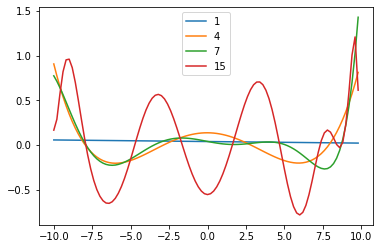

# MSE_Check
Adding **Poisson** and **Gaussian** noise to a dataset of a trigonometric distribution, and evaluating the MSE values.

The dataset is initiated as below:

```ruby
x = np.arange(-10, 10, 0.2)
y = (2 * np.cos(x)/(- np.pi)) + (2 * np.sin(2 * x)/(2 * np.pi)) + (2 * np.cos(3 * x)/(-3 * np.pi))
```

I add Gaussian and Poisson noise to the data using **NumPy**:

```ruby
gaussian_noise = np.random.normal(mean, var, size = len(y))
poisson_noise = np.random.poisson(2, len(y))
```

I define a function to calculate the estimated Gaussian and Poisson distributions by computing matrix A (with different exponents of x) and computing B according to the corresponding mathimatical expressions. The function in the code:

```ruby
def estimations (x,y,n)
```

I find **minimum** and **maximum** errors of all the 15 different estimations.

As follows, it can be seen that the best degree of the estimator is 15 and the worst is 1:

<h4>Gaussian Model:</h4>

min gaussian index =  15

max gaussian index =  1

<h4>Poisson Model:</h4>

min poisson index =  15

max poisson index =  1

Plotting the calculated estimations, and finding **MSE error** for each of them, the results are as follows:

<h4>Gaussian Model for different values of n:</h4>

MSE error gaussian model n=1 0.28776835909197235

MSE error gaussian model n=4 0.22964726615829797

MSE error gaussian model n=7 0.20982053507166448

MSE error gaussian model n=15 0.0508144148443766

<h4>Poisson Model for different values of n:</h4>

MSE error poisson model n=1 0.28776835909197235

MSE error poisson model n=4 0.22964726615829797

MSE error poisson model n=7 0.20982053507166448

MSE error poisson model n=15 0.0508144148443766



By using the mathematical expressions we have for **bias** and **variance**, I define the two functions below to calculate these values:

```ruby
def var_calc(f)
def bias_calc (f,f_star,variance)
```

Finally, I calculate bias and variance for each of the cases. The final results are as follows:

<h4>n = 1</h4>

variance for n=1 gaussian =  [0.00010497]

variance for n=1 poisson =  [0.00051191]

bias for n=1 gaussian =  0.48857515069655155

bias for n=1 poisson =  0.49278958808790874

<h4>n = 4</h4>

variance for n=4 gaussian =  [0.05712822]

variance for n=4 poisson =  [0.05007849]

bias for n=4 gaussian =  0.3530710597522217

bias for n=4 poisson =  0.37908895177787416

<h4>n = 7</h4>

variance for n=7 gaussian =  [0.0727685]

variance for n=7 poisson =  [0.07730579]

bias for n=7 gaussian =  0.3055791256898673

bias for n=7 poisson =  0.29875378998089364

<h4>n = 15</h4>

variance for n=15 gaussian =  [0.23891561]

variance for n=15 poisson =  [0.24386541]
